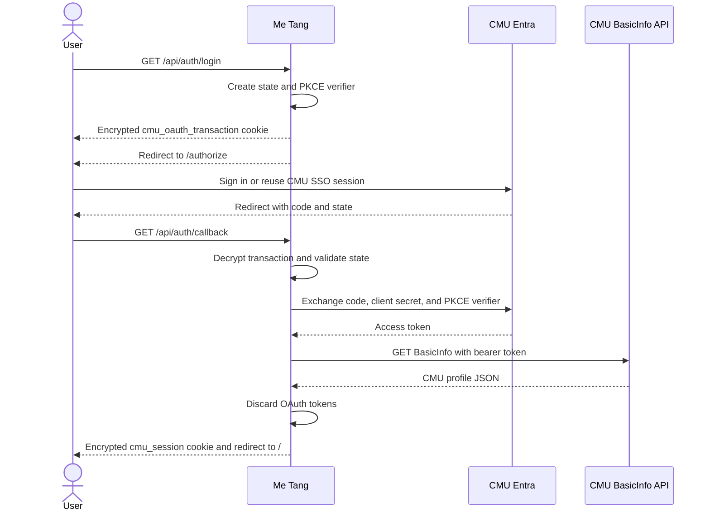

# CMU Entra SSO

This document describes the CMU Entra sign-in implementation in Me Tang. It covers the
application registration, environment variables, request flow, session design, deployment,
and troubleshooting.

## What the implementation provides

The application uses the OAuth 2.0 authorization-code flow with a confidential client:

- CMU Entra signs the user in and asks for delegated CMU API consent.
- The Next.js server exchanges the authorization code using the application client secret.
- The server calls the CMU BasicInfo API with the access token.
- The application creates its own encrypted, eight-hour session containing the BasicInfo
  profile.
- Access and refresh tokens are discarded after BasicInfo is fetched.

Users receive an SSO experience when they already have an active CMU Entra browser session.
However, the current implementation does not request the `openid` scope or validate an ID
token. It uses the successful delegated BasicInfo request to establish the local application
session. If standards-based authentication claims are required later, extend the flow to
OpenID Connect with ID-token signature, issuer, audience, nonce, and expiry validation.

## Implementation map

| Area | File or route | Responsibility |
| --- | --- | --- |
| Shared authentication library | `lib/cmu-auth.ts` | Configuration, PKCE, state, encryption, profile sanitization, and session reads |
| Start login | `GET /api/auth/login` | Creates the OAuth transaction and redirects to CMU Entra |
| Complete login | `GET /api/auth/callback` | Validates the callback, exchanges the code, and fetches BasicInfo |
| Logout | `POST /api/auth/logout` | Deletes the local session and redirects through Entra logout |
| Login/profile UI | `app/page.tsx` | Shows login status and the complete BasicInfo JSON response |

The application does not currently persist CMU identity information to Postgres.

## Request sequence



### 1. Login request

`GET /api/auth/login` reads the server-side configuration and creates:

- A cryptographically random OAuth `state` value.
- A PKCE verifier and SHA-256 challenge.
- An encrypted `cmu_oauth_transaction` cookie that expires after ten minutes.

The browser is redirected to the configured `AUTH_URL` with `response_type=code`,
`response_mode=query`, the callback URI, scope, state, and PKCE challenge.

### 2. Callback and token exchange

CMU Entra redirects to `GET /api/auth/callback`. The callback requires all three values:

- Authorization `code` from Entra.
- Returned `state` from Entra.
- Encrypted `cmu_oauth_transaction` cookie from the login request.

The server decrypts the cookie, checks its expiry, and compares the two state values using a
timing-safe comparison. It then posts the code, client ID, client secret, callback URI, scope,
and PKCE verifier to `TOKEN_URL`.

### 3. BasicInfo and application session

After receiving an access token, the callback sends:

```http
GET https://api.cmu.ac.th/mis/cmuaccount/prod/v3/me/basicinfo
Authorization: Bearer <access-token>
```

The complete JSON-compatible BasicInfo response is sanitized and encrypted into the local
`cmu_session` cookie. The signed-in page currently renders both individual fields and the
formatted JSON response. Because BasicInfo can contain personal data, the raw response view
should be removed or restricted before using the page outside development or administration.

The OAuth access token and any returned refresh token are not stored in the browser, database,
or local session.

### 4. Logout

The page submits `POST /api/auth/logout`. The route expires `cmu_session` and sends a `303`
redirect to `LOGOUT_URL`. The configured Entra endpoint then returns the browser to the URL in
`post_logout_redirect_uri`.

## Entra application registration

The CMU reference setup uses a Web platform registration with an authorization-code client
secret.

1. Open the Entra application and select **Authentication**.
2. Add the **Web** platform.
3. Register the exact callback URI used by the application:

   ```text
   http://localhost:8080/api/auth/callback
   ```

4. Under **Certificates & secrets**, create a client secret and store its value securely.
   Track its expiry and rotate it before it expires.
5. Under **API permissions**, select **APIs my organization uses**, then **CMU API**.
6. Add the delegated permission:

   ```text
   Mis.Account.Read.Me.Basicinfo
   ```

The callback URI must match `CALLBACK_URL` exactly, including scheme, host, port, and path.
Register the HTTPS production callback separately when deploying.

## Environment variables

All authentication variables are server-side. None of them needs the `NEXT_PUBLIC_` prefix.

| Variable | Secret | Purpose |
| --- | --- | --- |
| `AUTH_URL` | No | CMU tenant OAuth authorization endpoint |
| `TOKEN_URL` | No | CMU tenant OAuth token endpoint |
| `CALLBACK_URL` | No | Exact registered application callback URI |
| `CLIENT_ID` | No | Entra application/client ID |
| `CLIENT_SECRET` | Yes | Entra confidential-client credential |
| `SESSION_SECRET` | Yes | Encrypts and authenticates local cookies |
| `SCOPE` | No | Delegated CMU API scopes requested during login |
| `BASICINFO_URL` | No | CMU BasicInfo resource endpoint |
| `LOGOUT_URL` | No | Entra logout endpoint and post-logout redirect |
| `EXT_PORT` | No | Reference/development port; the Next.js code does not read it |

Example development configuration:

```dotenv
EXT_PORT=8080
AUTH_URL=https://login.microsoftonline.com/cf81f1df-de59-4c29-91da-a2dfd04aa751/oauth2/v2.0/authorize
TOKEN_URL=https://login.microsoftonline.com/cf81f1df-de59-4c29-91da-a2dfd04aa751/oauth2/v2.0/token
CALLBACK_URL=http://localhost:8080/api/auth/callback
CLIENT_ID=replace-with-application-id
CLIENT_SECRET=replace-with-client-secret
SESSION_SECRET=replace-with-a-random-value-of-at-least-32-characters
SCOPE=api://cmu/Mis.Account.Read.Me.Basicinfo offline_access
BASICINFO_URL=https://api.cmu.ac.th/mis/cmuaccount/prod/v3/me/basicinfo
LOGOUT_URL=https://login.microsoftonline.com/cf81f1df-de59-4c29-91da-a2dfd04aa751/oauth2/v2.0/logout?post_logout_redirect_uri=http://localhost:8080
```

Use only one definition for each variable. When a dotenv file contains duplicate keys, the
effective value may depend on the loader and can be difficult to diagnose.

### `SESSION_SECRET`

`SESSION_SECRET` is not provided by CMU. It belongs to this application and derives the
AES-256-GCM key used for both authentication cookies. Generate it once per environment:

```bash
openssl rand -base64 32
```

It must contain at least 32 characters. Use the same value on every application instance.
Rotating the value invalidates all active login transactions and user sessions.

### `NEXT_PUBLIC_CLIENT_ID`

`NEXT_PUBLIC_CLIENT_ID` is not read by this implementation. The authorization URL is assembled
on the server using `CLIENT_ID`. Never create `NEXT_PUBLIC_CLIENT_SECRET` or
`NEXT_PUBLIC_SESSION_SECRET`; Next.js exposes `NEXT_PUBLIC_*` values to browser code.

### Scope behavior

The CMU reference scope includes `offline_access`, so Entra may return a refresh token. This
implementation intentionally discards refresh tokens and does not refresh CMU API access. If
offline access is not required by future functionality, consider removing `offline_access`
after confirming the desired behavior with the CMU application owner.

## Cookie and session behavior

| Cookie | Lifetime | Contents | Attributes |
| --- | --- | --- | --- |
| `cmu_oauth_transaction` | 10 minutes | OAuth state, PKCE verifier, and expiry | `HttpOnly`, `SameSite=Lax`, `Path=/`, `Secure` in production |
| `cmu_session` | 8 hours | Sanitized BasicInfo profile, login time, and expiry | `HttpOnly`, `SameSite=Lax`, `Path=/`, `Secure` in production |

Both cookies are encrypted and authenticated with AES-256-GCM. The encryption key is a SHA-256
digest derived from `SESSION_SECRET`. Cookie decryption or authentication failure results in no
valid session.

The complete profile is stored in a browser cookie. Browser cookie limits are commonly around
4 KB per cookie. If CMU expands the BasicInfo payload beyond that size, move application
sessions to a server-side store and keep only an opaque session identifier in the cookie.

## Local development

1. Copy the environment template:

   ```bash
   cp .env.example .env
   ```

2. Replace all placeholders and ensure each variable appears only once.
3. Start Next.js on the callback port:

   ```bash
   npm run dev -- -p 8080
   ```

4. Open <http://localhost:8080>.
5. Select **เข้าสู่ระบบด้วย CMU Account**.
6. Complete CMU sign-in and consent.
7. Confirm the page displays the expected BasicInfo profile.
8. Test **ออกจากระบบ** and confirm both the local session and Entra session are cleared as
   expected.

## Production checklist

- Register the exact HTTPS production callback in Entra.
- Set `CALLBACK_URL` to that registered HTTPS URI.
- Change `post_logout_redirect_uri` in `LOGOUT_URL` to the HTTPS application origin.
- Store `CLIENT_SECRET` and `SESSION_SECRET` in the deployment secret manager.
- Use one stable `SESSION_SECRET` across all instances.
- Do not log authorization codes, access tokens, refresh tokens, or cookie values.
- Remove or restrict the raw BasicInfo display if end users do not need it.
- Track the Entra client-secret expiry and rotate it before expiration.
- Request only the delegated permissions required by the application.
- Confirm production responses set both authentication cookies with `Secure`.

## Errors and troubleshooting

| Application error | Meaning | Checks |
| --- | --- | --- |
| `configuration` | A required variable is missing, is still a placeholder, or is invalid | Check all variables and ensure `SESSION_SECRET` is at least 32 characters |
| `access_denied` | Entra returned an OAuth error | Check whether the user cancelled or lacks access/consent |
| `invalid_callback` | Code, state, or transaction cookie is missing | Restart login; check browser cookie policy and callback host |
| `invalid_state` | Transaction expired, could not decrypt, or state did not match | Restart within ten minutes; check that all instances share `SESSION_SECRET` |
| `token_exchange_failed` | Entra rejected the code exchange | Check client ID, client secret, callback URI, scope, and secret expiry |
| `profile_failed` | BasicInfo returned an error or unusable JSON | Check delegated permission, scope, token audience, and CMU API availability |
| `login_failed` | An unexpected callback error occurred | Review server logs without printing tokens or secrets |

### Common redirect mismatch

These values must be identical:

- Redirect URI registered under the Entra Web platform.
- `CALLBACK_URL` in the running application.
- `redirect_uri` sent to both the authorization and token endpoints.

For example, `localhost:3000`, `localhost:8080`, and `127.0.0.1:8080` are different redirect
URIs.

### Login works once but fails on another instance

All deployed instances must use the same `SESSION_SECRET`. Otherwise one instance cannot
decrypt a transaction or session cookie created by another instance.

## Security boundaries and limitations

- `CLIENT_SECRET`, `SESSION_SECRET`, OAuth codes, and OAuth tokens are server-only.
- OAuth state mitigates login CSRF and callback substitution.
- PKCE binds the authorization code to the browser-initiated transaction.
- Tokens are used only long enough to retrieve BasicInfo and are then discarded.
- The local session is encrypted, authenticated, HTTP-only, and time-limited.
- Local logout is initiated with POST to avoid a logout action embedded as a normal link.
- This is not currently a full OpenID Connect relying-party implementation because it does not
  validate an ID token.
- Revoking CMU access does not immediately revoke an already-issued eight-hour local cookie.
- There is no server-side session revocation list; rotating `SESSION_SECRET` invalidates every
  session at once.

## References

- [CMU authorization-code client-secret setup](https://gitlab.mis.cmu.ac.th/supawit.w/cmu-authorization-consumer/-/tree/main/auth-code-client-secret)
- [CMU PHP authorization-code example](https://gitlab.mis.cmu.ac.th/supawit.w/cmu-authorization-consumer/-/tree/main/example/oauth-php-auth-code-client-secret)
- [Microsoft identity platform authorization-code flow](https://learn.microsoft.com/en-us/entra/identity-platform/v2-oauth2-auth-code-flow)
- [Microsoft identity platform OpenID Connect and sign-out](https://learn.microsoft.com/en-us/entra/identity-platform/v2-protocols-oidc#send-a-sign-out-request)
